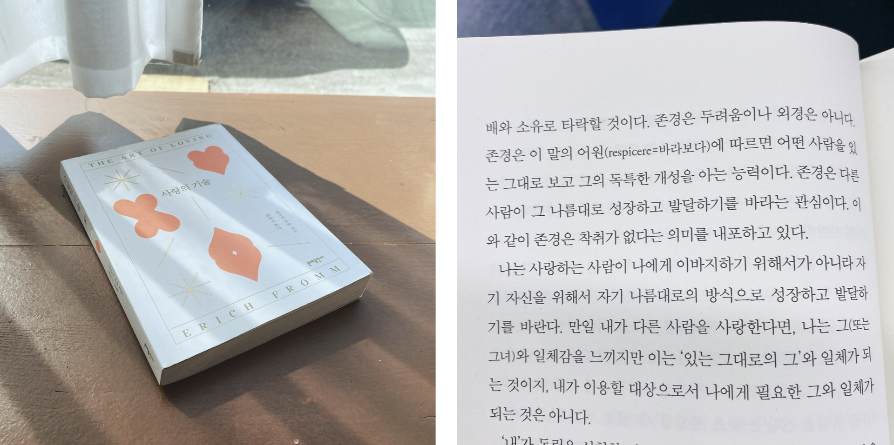
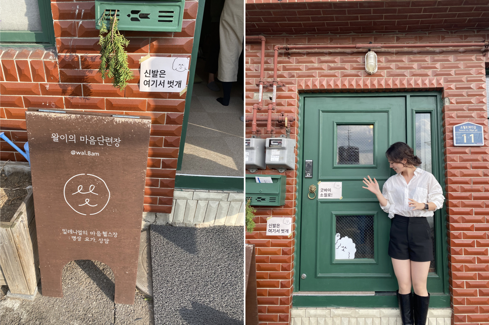
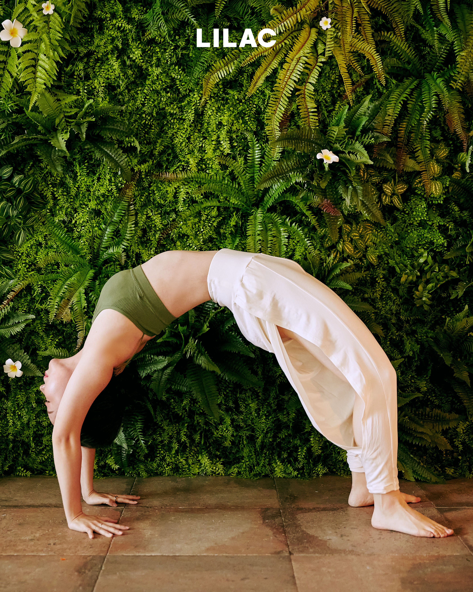

인스타그램에서 보이던 **#트래바리연말결산** 을 빌려왔습니다.

이걸 쓰고 나면 그래도 올해의 굵직한 것들에 대해 정리가 될 것 같은데 적지 못한 에피소드와 주제들도 많다. 정말 밀도 있는 1년이였다. 

#### 📚 올해의 책

**사랑의 기술 / 러브 팩추얼리**

올해 책 정말 많이 읽었다. 특히 하반기는 활자중독자처럼 살았다.   
대부분의 책들이 더할나위 없이 훌륭했지만 그래도 나의 "올해의 책"은 이 두 개라고 고민 없이 말할 수 있다! (1년간 나의 최대 관심사가 무엇이였지 투명하게 드러나는 선택이다. ㅎㅎ) 이 책을 전국민 필독 도서로 선정해야 마땅하다.  
사랑에 대해 과도한 환상 혹은 두려움을 심어주는 대중매체가 언제나 거북했지만 그렇다고 떨쳐내지도 못하는 속박 속에 살아왔다. 두 책을 읽고 나니 무엇이 좋은 사랑인지, 내 맘처럼 되지 않아 괴로웠던 지난 사랑들을 미워하기 보다는 조금 더 포용해볼 수 있었다. (오히려 읽고 나니 더 어려워진 것 같기도 하다.)  할 말이 아주 많은데 언젠가 독후감을 써보고 싶다. 꼭 둘 중 하나만 읽어야 한다면 사랑의 기술. 하지만 둘 다 읽으시면 더 좋습니다!

#### 📝 올해의 글귀 

**류시화, 좋은지 나쁜지 누가 아는가** 중

... 그래서 가슴을 연채로 살면 상처받을 수도 있다. 하지만 가슴을 닫은 채로 사는 것 만큼 많이 상처받지는 않는다. 우리는 이 곳에 무엇을 배우러 왔을까? 사랑이였을까? 우리의 문제는 단 한 가지일 것이다. '나'의 범위를 '나'로 한정 짓는 것. 그래서 '나' 이외에는 모두 타인이며 타자라고 믿는 것. 반면에 공감과 연민은 우리를 더 큰 '나'로 만든다. 어느 명상 센터에서는 이렇게 기도한다.

 *'내가 가능한 한 사랑과 연민의 마음을 갖기를. 만약 내가 이 순간에 사랑과 연민의 마음을 가질 수 없다면 친절하기를. 만약 내가 친절할 수 없다면 판단하지 않기를. 만약 내가 판단하지 않을 수 없다면 해를 끼치지 않기를. 만약 내가 해를 끼치지 않을 수 없다면 가능한 한 최소한의 해를 끼치기를.'*

#### 🤓 올해의 배움

**명상**

이건 올해의 배움이면서 만 30년 인생 중 최고의 배움이기도 했다. "현존" 이라는 것이 얼마나 귀한 것인지 온 몸으로 느낄 수 있는 값진 시간들이였고, 평생 하고 싶다. 자세한 이야기는 따로 글을 써보고 싶다. [관심이 있으시다면 여기로](https://instagram.com/wal.8.am)

#### 📸 올해의 사진

**바디프로필**

약 네 달만에 몸무게 앞자리가 두 번 바뀌었다. 뒤도 돌아보지 않고 운동만 하니 체중감량을 당했다 (정말 당했다 의도하지 않았다 난 행복한 돼지인게 좋았던 사람..)  총 3가지 테마로 6장의 사진을 얻었다. 감사하게도 대체로 사진이 잘 나와주어서 사진을 고르는데 조금 애를 먹었다. 😅

#### ✅ 올해의 키워드

**연민**

*Love yourself* 라는 문장이 왠지 너무 오그라들고 유치하다고 생각했던 시절이 길었다. (BTS가 저 키워드로 활동을 했을 때는 어딘가 삐딱하게 바라보기도 했었다.) 이제와서 알게 되었는데 그 이유는 어떻게 해야하는지도 모르겠고, 너무 어려운 일인데 해야만 한다고 강요하는 것 같아서 비롯된 거부감이였다. 그리고 그런 마음을 가지면 스스로의 부족한 모습에 대한 향상심 대신 나태하게 안주하게 될 것만 같았다. 
부족한 스스로를 미워하고 궁지에 몰아세우는 것이 빠르게 성장하는 길이라고 생각했던 나는 연민이 가지는 의미의 존재 조차 모르고 살았다. 보통 "자기연민"을 경계하라는 말들을 많이 하는데 실은 연민의 뜻을 잘못 알고 이야기하는 것이였다. 
우리가 경계해야 하는 것은 대상을 낮잡아보는 의미를 가지는 동정이고, 연민 은 대상을 동등한 시선으로 바라보며 어떻게 하면 도울 수 있을까? 라고 고민하는 것을 뜻한다고 한다. 내가 나의 가장 친한 친구가 되어 기쁠 때나 슬플 때나 손을 내밀어 준다는 것이 무엇인지 처음 알았다. 

정리하자면, 자기연민은 모든 것에 자신감이 떨어진다고 느낄 때 스스로를 이 불행을 이겨내기 어려운 불쌍한 나, 무기력한 나. 이렇게 여기며 아무것도 안하고 멍하니 있는 것이 아니라, 맛있는 것을 먹고 좋아하는 운동을 하고 따뜻한 볕을 쬐러 가는 등 대상이 선하고 건강하게 나아갈 수 있도록 방법을 도모하는 것이다. 

#### 👫 올해의 사람 

**너. 그리고 나.** 

태어나서 처음으로 나라는 사람에 대해 아주 오랜 시간 돌아보고 고민한 해였기에.  그리고 그 어떤 순간에도 지칭할 때 절대로 "너" 라고 차갑게 부르지 않으려고 나를 노력하게 만든 너를 빼놓고는 올해를 결코 설명할 수 없다.

#### 🥟 올해의 음식

**만두와 떡볶이**

#### 💸 올해의 소비

**필라테스 1대1 레슨** 

큰 맘 먹고 질러보았다. (필라테스는 너무 집중하느라 수업 전후로도 찍은 사진이 하나도 없다.. ^^;)  좋은 선생님과 좋은 운동이 만나 정말 너무너무 재밌었고 (진심) 그러나 두번은 하기 싫다 (진심2)... 운동을 좋아하는 나를 저 바닥 끝까지 겸손하게 만든 운동. 이 세상의 모든 필라테스 강사님들 진심으로 존경합니다! 필라테스 덕분에 몸이 더 잘 자리잡아 바디프로필 찍을 수 있었다.

**🚰 아차상1**: 브리타 정수기. 매일 패트병 생수 주문하면 환경파괴범이 되는 죄책감을 떨칠 수 없었는데 드디어 부채감에서부터 자유로워졌다. 지구사랑 나라사랑

**🤸🏻‍♀️ 아차상2:** 룰루레몬 레깅스. 여러가지 이유 (딱히 가격때문만은 아님) 로 눈물 줄줄 흘리며 샀는데 정말 눈이 휘둥그레지는 편안함에 돈이 하나도 아깝지 않았다. 선물받으면 혹시 이 사람 나한테 프로포즈 하는건가? 라고 생각하기로 했다. (어느정도 진심임)

#### 🎼 올해의 음악

<iframe width="560" height="315" src="https://www.youtube.com/embed/UuV2BmJ1p_I" frameborder="0" allow="accelerometer; autoplay; clipboard-write; encrypted-media; gyroscope; picture-in-picture" allowfullscreen></iframe>

#### 👋🏻 그리고 내년의 신예

지금을 살자!

 

